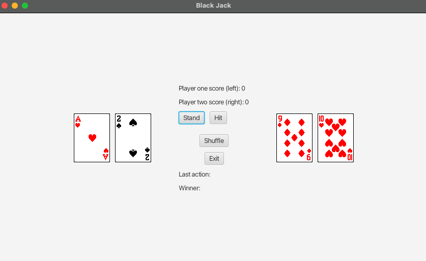

# Final Project - Black Jack

For this assignment we had to create a program in which a user plays a simple version of the card game 21 against a computer. This application should use GUI elements to show the player their cards. Your application should have a way to shuffle the deck, a way to deal cards to the players, and it should show the current score based on hands won/lost.

## Example Output



## Analysis Steps

I absolutely love that the instructions given to us stated that this game was supposed to be a "Simple version" of Black Jack. The reality is that perhaps it was more simple because anything more sophisticated would require an even greater amount of effort. Luckily I had this in mind. As with essentially every other project, and programming as a whole for that matter, I knew I'd have to break every item down to its most simplest version. Doing this made the project appear a lot smaller which helps with confidence. More details to follow...


### Design

I deconstructed the game into its smallest components. Within the entire game, there is game logic, within game logic, there are players, within the players are their corresponding hands, within their hands, are the "atoms" of the realm aka the actual cards. With this in mind, I starting from the bottom and worked my way up. I was fairly confident in this method so for the first two-thirds of the project, testing was not necessary. However, I did have to be extremely cautious and still look ahead at things that might become a sore in the future. I.e. card images. 

### Testing

Here are step by step examples of how my development and testing went...

Step one: 

```
Develop a gameplan. As stated earlier, I started by breaking down the problem into several sub-problems that would be easier to manage. Once I did that, the first thing I had to create were the card objects. The three items that I determined that every card should have would be the Suit, Rank, and a method to return the image path. I opted to go with String variables for each of these. This was the most basic class. I only had to create their respective getters and setters as well as the image path generator. 

```

Step two:

```
The next thing that I created was the deck since it would hold all the cards. Here I determined that I would need a few things. First, a method to generate the deck that contains all the cards, a method to draw a card, and a method to shuffle. Essentially, anything that had to do with the deck, I put in this class. In my previous Java course, I had created a deck of cards using an array list. This time around, I opted to use an array of string type. Within this method, all the cards were generated along with assignments of their suit and rank. 
```

Step three:

```
Now with the card object created and the deck object created, I determined that I had to create player objects to store things pertaining to each. For simplicity, I did not create a method for the players to name themselves. They are by default player one and player two. Additionally within this class, I created a "hand" array list that would contain and track each player's hand. Score, whether or not the player decided to stand, a method to add cards, get the hand value, and logic for adding up the player's hand were also included here. A few of those methods were added later in my journey when I realized that there was data that my GUI required that I couldn't reach. 
```

Step four:

```
Lastly, the game class was created. This was by far the most complex class I had to create. Anything that had to do with gameplay was included here. Things such as dealing the initial cards, returning winners, a tracker to see if two players were standing, a method to clear the hands of the players, a turn counter to track whose turn it was, a hit method, a stand method, and even a method to exit the game were included here. Logic for determining the winner based off events was here too. As with the previous class, in this class, I noticed that I was also missing things that I had not even thought of so I added it as I progressed. 
```

Step five:

```
Finally, I reached the end of the journey. It was all smooth sailing from here, right? Wrong... very wrong. Surprisingly, I think I struggled here the most. Because of the things I had not accounted for earlier in my voyage, I stuggled in a few areas. One thing I had not even thought about up until this point was actually displaying items in the GUI. The limited testing I was doing in my code was with method calls from the main method and reading what the console displayed. Although all my logic was working properly and I was able to play games in the console, I now needed a way to display all of the console items on the GUI. Unfortunately for me, it is not as simple as a System.Out.Println();. I started by building the buttons and testing them for functionality with method calls via .setOnAction(). This worked excellently so why complicate the process? I added several method calls to each button to run simultaneously. Since this is by no means an extremely complicated program with vasts amounts of data to run through it, the efficiency of the code wasn't too much of a worry. However, should this have been a larger program with a need for efficiency and speed, I would have had to spend a lot more time working on making sure that the code wasn't redunant and that I wasn't wasting time with method calls that could have been implemented in a different manner. 
```


## Notes

There were a few points in this project where I felt as if I was going to just have to give up, but I am glad that I didn't!! I learned several things and I have a heightened sense of appreciation for developers, frontend and backend. The amount of effort that it took to create this and have it work properly was insane. Not to mention that I believe what I made was an extremely simple version of the game. 

A special thank you to professor Markley. This is the final project of this class. Onto the next repository!

## Do not change content below this line
## Adapted from a README Built With

* [Dropwizard](http://www.dropwizard.io/1.0.2/docs/) - The web framework used
* [Maven](https://maven.apache.org/) - Dependency Management
* [ROME](https://rometools.github.io/rome/) - Used to generate RSS Feeds

## Contributing

Please read [CONTRIBUTING.md](https://gist.github.com/PurpleBooth/b24679402957c63ec426) for details on our code of conduct, and the process for submitting pull requests to us.

## Versioning

We use [SemVer](http://semver.org/) for versioning. For the versions available, see the [tags on this repository](https://github.com/your/project/tags). 

## Authors

* **Billie Thompson** - *Initial work* - [PurpleBooth](https://github.com/PurpleBooth)

See also the list of [contributors](https://github.com/your/project/contributors) who participated in this project.

## License

This project is licensed under the MIT License - see the [LICENSE.md](LICENSE.md) file for details

## Acknowledgments

* Hat tip to anyone who's code was used
* Inspiration
* etc
