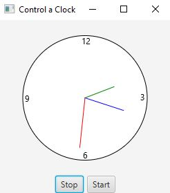

# Control a Clock

In this project, we had "legacy code" to work with. The basic structure of the clock was already developed. This included, the clock's 
shape, the three clock hands, and the 4 numbers on the clock. Needless to say, the bulk of the coding was already given to us, but an
understanding of how the code worked was needed to implement a new function. In its current state, the clock would reflect the time that
the program was started and that is all. It would not update as time passed. It was a static object. The details asked for a start and
stop feature to be added which inadvertently meant that the clock would have to update as time passed. 

## Example Output



## Analysis Steps

To start and stop the time, two buttons had to be created with event handlers that ran specific methods, each corresponding to their 
respesctive button. Thankfully (and luckily), this came easy to me because of the 
[previous project](https://github.com/chrisdeleon/CIS171-ChrisDeLeon/tree/main/RacingCar) I did. 

I broke this project up into a few section. Which will be explained in testing. 

### Design

The design of the program was straightforward. Make clock update as time passes. Add two buttons. Make one button stop. Make the other
start. Easy, right? No. It is never that easy. It is always easy in theory, but in practice it is not so rainbows and butterflies. 


### Testing

Step One

```
I had to get familiar with the starter code. I should not expect to be able to create a functioning program if I cannot understand the
program I am starting with. Although it felt like it was extremely time-consuming and a bit of a waste, I know that the time I did spend
looking over the methods, classes, and other variables would save me a lot of time in the long run. Once I was familiar with the code, I
knew I had to immediately change a couple of things.  
```

Step Two

```
The first thing I had to do was get rid of the time that reflected at the bottom of the initial program. Now that I think about it, I did
not necessarily have to completely delete it, but I did have to replace where it was positioned with the two buttons. We were given an 
image to reference so I based all my decisions as far as visuals go on that image. That is why the time string had to go. I ended up replacing
that time string with a horizontal box that contained the two buttons. You can see the code in lines 36-51. 
```

Step Three

```
Once the buttons were created, I implemented a Timeline to control the animation. In the Timeline object, I would run the setCurrentTime 
method which, as the name says, updated the time to the current time. With the knowledge from my previous project, I knew that I would have
to create this object within the ClockPane class. I would go about stopping and starting the clock in a similar method as well; pause/play
the Timeline when the user clicked the corresponding button. I created two methods for that functionality (lines 109-118). 
```

Step Four

```
After making the methods and creating the buttons, the final step to complete the button portion, which was essentially the last aspect 
of the project, I had to connect them to eachother. To do this, I created event handlers that would run a method and then I linked those
event handlers to the corresponding button. 
```

## Notes

This project was extremely similar to the previous one. The only major difference was that the last project had no starter files and this
project had some files we had to work with. Based off how these clocks work, I believe a pathway to creating stopwatch would be quite easy
and perhaps a future project to do. At this point, JavaFX syntax is becoming quite easy to read/understand. 

## Do not change content below this line
## Adapted from a README Built With

* [Dropwizard](http://www.dropwizard.io/1.0.2/docs/) - The web framework used
* [Maven](https://maven.apache.org/) - Dependency Management
* [ROME](https://rometools.github.io/rome/) - Used to generate RSS Feeds

## Contributing

Please read [CONTRIBUTING.md](https://gist.github.com/PurpleBooth/b24679402957c63ec426) for details on our code of conduct, and the process for submitting pull requests to us.

## Versioning

We use [SemVer](http://semver.org/) for versioning. For the versions available, see the [tags on this repository](https://github.com/your/project/tags). 

## Authors

* **Billie Thompson** - *Initial work* - [PurpleBooth](https://github.com/PurpleBooth)

See also the list of [contributors](https://github.com/your/project/contributors) who participated in this project.

## License

This project is licensed under the MIT License - see the [LICENSE.md](LICENSE.md) file for details

## Acknowledgments

* Hat tip to anyone who's code was used
* Inspiration
* etc
