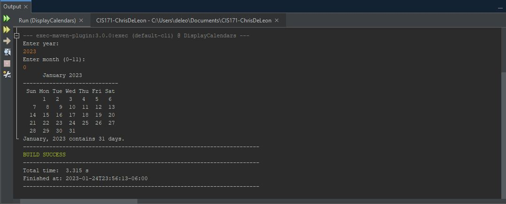

# Display Calendars

This project focused on using abstract classes, more specifically, using a Gregorian Calendar

## Example Output



## Analysis Steps

This assignment called for rewriting previous code to display a calendar for a specified month 
using the calendar and GregorianCalendar classes. The program receives a month and a year from user input.
Since the desired output was already demonstrated, restructuring the code was the only thing necessary.

### Design

My approach was to take the code that formatted the actual calendar and apply the calendar and 
GregorianCalendar classes to it. I studies the old code to see how it functioned and then thought
of ways in which I could implement more efficient code. 

### Testing

Step one: 
```
I needed to ensure I was able to recall the proper month according to the user's input.
Professor Markley provided some basic code that help me determine the manner in which to approach this.
```
Step two: 
```
After I had the correct month, I had to obtain the maximum number of days within said month. 
With the GregorianCalendar and Calendar classes, I did not have to worry about leap years since they
accounted for that automatically. 
```
Step three: 
```
I then had to populate the calendar and have it match up the day number with the day name. 
I used the code that had already been provided, but at the time of implementation, for some reason, my
code would not format the same, even though all the logic was correct. 
```
Step four: 
```
I added the additional required output at the end of the program. I just reused code
from before to have it appear in the console. 
```
End: 
```
At this point it was just a matter of feeding the numbers to the code and ensuring that
the output matched what I had in my calendar. 
```
## Notes

I was not able to figure out the formatting for the day number to match up with its corresponding
day name. E.g. 1 to Monday, 2 to Tuesday, etc...

## Do not change content below this line
## Adapted from a README Built With

* [Dropwizard](http://www.dropwizard.io/1.0.2/docs/) - The web framework used
* [Maven](https://maven.apache.org/) - Dependency Management
* [ROME](https://rometools.github.io/rome/) - Used to generate RSS Feeds

## Contributing

Please read [CONTRIBUTING.md](https://gist.github.com/PurpleBooth/b24679402957c63ec426) for details on our code of conduct, and the process for submitting pull requests to us.

## Versioning

We use [SemVer](http://semver.org/) for versioning. For the versions available, see the [tags on this repository](https://github.com/your/project/tags). 

## Authors

* **Billie Thompson** - *Initial work* - [PurpleBooth](https://github.com/PurpleBooth)

See also the list of [contributors](https://github.com/your/project/contributors) who participated in this project.

## License

This project is licensed under the MIT License - see the [LICENSE.md](LICENSE.md) file for details

## Acknowledgments

* Hat tip to anyone who's code was used
* Inspiration
* etc
