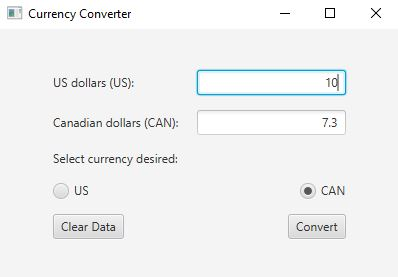

# Exam 2 - Program that Converts US Dollars to CAN Dollars

For this project, we had to Write a program that converts US dollars into 
Canadian dollars. The program should let the user 
enter an amount in US dollars and display the equivalent value in Canadian 
dollars when the Convert button is clicked. One Canadian dollar is 0.73 US.
All good coding styles, conventions and standards must be used when completing 
this project in order to get full credit. 

## Example Output



## Analysis Steps

The requirements of this program appeared to be very easy when I looked at them. 
For that reason, I wanted to take it a step further and implement functionality
that allowed the user to select which currency to display results for.

### Design

I broke my approach up into smaller, bite-sized pieces so that the project does 
not become overwhelming. I started by mimicking the design of the image that was
provided for us to get an idea of what the program requirements were. You can see more
on this in the testing section.

### Testing

Step one: 

```
First, I created the front end of the program. Everything that the user would see
I created in this step. Since I was familiar with Grid Pane, Radio Buttons, 
Buttons, Text Fields, and Labels, this section was quick. Aligning everything
with Grid Pane was simple. The only hiccup I had at this point was that I had not
encountered having to align an object within its grid space/cell. I was able to achieve
this by taking a look at the JavaFX documentation. You can see how I achieved this
starting at line 135.
```

Step two:

```
After the frontend was constructed, I focused on adding the event listeners to all of the
attributes. Since I was taking this project an extra step further, I also had to add event 
listeners to the radio buttons I created. The radio buttons allow the user to select which currency
they would like results for. Based on the user's selection, it deactivates editability for the text
field that will be displaying the results. 
```

Step three:

```
Step two bled into step three a little bit. The majority of step three was creating the methods that would
be firing off when the event listener was activated. I decided to create two static methods within the Operations
class that can be found starting on line 145. I also added a button that allows the user to clear the page
of any previous data. Again, not something that was needed for this project, but something that I felt gave it a
bit of a personal touch.
```

Step four:

```
This step was the final step, besides testing and debugging, of course. At this point, I was creating the methods to
convert US dollars to CAN dollars and, likewise, CAN dollars to US dollars. This section required only a little bit
of math, but mostly required adding code that would convert the input string to a double and then turn the product of
the multiplication or division back into a string to display it to the user on the front end. This section also contained
the creation of the decimal formatter that provides two decimal places when there would otherwise be an extremely long number. 
```

## Notes

All in all, this project was a culmination of several things I have been learning so far. It was really nice being able to see
how various factors work together to create one product.

## Do not change content below this line
## Adapted from a README Built With

* [Dropwizard](http://www.dropwizard.io/1.0.2/docs/) - The web framework used
* [Maven](https://maven.apache.org/) - Dependency Management
* [ROME](https://rometools.github.io/rome/) - Used to generate RSS Feeds

## Contributing

Please read [CONTRIBUTING.md](https://gist.github.com/PurpleBooth/b24679402957c63ec426) for details on our code of conduct, and the process for submitting pull requests to us.

## Versioning

We use [SemVer](http://semver.org/) for versioning. For the versions available, see the [tags on this repository](https://github.com/your/project/tags). 

## Authors

* **Billie Thompson** - *Initial work* - [PurpleBooth](https://github.com/PurpleBooth)

See also the list of [contributors](https://github.com/your/project/contributors) who participated in this project.

## License

This project is licensed under the MIT License - see the [LICENSE.md](LICENSE.md) file for details

## Acknowledgments

* Hat tip to anyone who's code was used
* Inspiration
* etc
