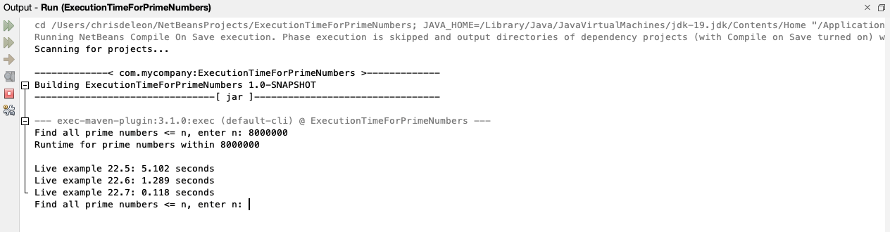

# Execution Time for Prime Numbers

Write a program that obtains the execution time for finding all the prime numbers less than 8 million, 10 million, 
12 million, 14 million, 16 million and 18 million using the algorithms in LiveExamples 22.5-22.7. Your program should
print a formatted table.

## Example Output



## Analysis Steps

For this section, the algorithms for discovering prime numbers was already given. Because of that, I only had to gauge 
the run-time for each algorithm, something I had done in a previous project. Once that was complete, I had to print the 
results.

### Design

At first, I thought the design would be simple, but boy was I in for a treat. This is what it turned out to be in the end.
I had to remove excess code from the algorithms so that each one would be evaluated equally. I also had to figure out
how to print all the results. Another thing I had to do was make sure that they could all work within one method, although, 
now that I think about it, I could have made each of them their own method, but there's no fun in that :)

### Testing

Step one:

```
Import all the "legacy" code. This was as easy as copying and pasting the code, until it was not. I wanted to ensure
that the benchmarks I was going to be running were all "fair" in that they all tested the same thing. What I soon realized
was that all three different programs had code that did not have to be included. What I did was remove any unnecessary 
print statements, adjust any variables that depended on the user's input, and made sure that there were not any instances
of code that did not directly relate to the algorithm. What I was left with was the bare-bones of the algorithms. 
```

Step two:

```
Now that all of the code was simplified, I needed to be able to test the time. I chose to do this by using time signatures
for each algorithm at the beginning and at the end. With those two points, I could calculate the actual amount of time it 
took to run the algorithm, down to nanoseconds if desired. I went with milliseconds since it is easier to read for more 
people. 
```

Step three:

```
Now that the times are calculate and the algorithms are running, I just had to put it all into a little, cute table 
and call it a day, right? Wrong. This cute, little table cost me several hours of my day troubleshooting and reformatting. 
I was not able to get the times to appear exactly how I wanted them to appear in the exact position they needed to appear. 
I unfortunately was not able to complete that section properly. With that said, I did provide a type of alternate 
printing to the console, but it is not as nice as the table. 
```

## Notes

If you do not want to run all the iterations of the program because of time limitations, you can adjust the number of
iterations by changing the number 6 in the for-loop on line 19. Otherwise, the program will ask you to enter 6 different
numbers to test. 

## Do not change content below this line
## Adapted from a README Built With

* [Dropwizard](http://www.dropwizard.io/1.0.2/docs/) - The web framework used
* [Maven](https://maven.apache.org/) - Dependency Management
* [ROME](https://rometools.github.io/rome/) - Used to generate RSS Feeds

## Contributing

Please read [CONTRIBUTING.md](https://gist.github.com/PurpleBooth/b24679402957c63ec426) for details on our code of conduct, and the process for submitting pull requests to us.

## Versioning

We use [SemVer](http://semver.org/) for versioning. For the versions available, see the [tags on this repository](https://github.com/your/project/tags). 

## Authors

* **Billie Thompson** - *Initial work* - [PurpleBooth](https://github.com/PurpleBooth)

See also the list of [contributors](https://github.com/your/project/contributors) who participated in this project.

## License

This project is licensed under the MIT License - see the [LICENSE.md](LICENSE.md) file for details

## Acknowledgments

* Hat tip to anyone who's code was used
* Inspiration
* etc
