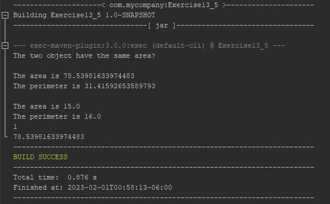

# Enable GeometricObject comparable

The purpose of this project was to implement and familiarize ourselves with the 
Comparable interface. This project helped visualize how the Comparable interface
can be used to compare different data types.

## Example Output



## Analysis Steps

The assignment had two parts. The first part was to implement the Comparable
interface and the second part was to create a static max method that returns the
larger of two objects. 

### Design

Since we were given a starting template of code from the reading resource, a big
part of this assignment was getting familiar with the code and figuring out how 
all the different parts work together and how they work alone as well. After that, 
the only thing necessary was actually including the new methods.

### Testing

Step one: 

```
Walk-through the video of how the legacy code was established and then experiment
with it.
```
Step two:

```
Implement the Comparable interface with the specified object. In this scenario,
the object was GeometricObject.
```
Step three:

```
Test the comparable with the legacy code to see if it worked in the main method.
```
Step four: 

```
Create the static max method that returns the larger of two GeometricObjects.
```

End:

```
Test the static max method in the main method with new code, adding on to the 
legacy code. This step was necessary because the legacy code only provided two 
GeometricObjects, instead of the 4 necessary to accomplish the task.
```

## Notes

I did not have a hard time implementing either of these methods, but for some reason, 
the IDE was using was not able to compile my code when I had finished. This drew me 
back a bit of time and I was only able to resolve the issue by creating a new project. 
I am still getting familiar with NetBeans. 

## Do not change content below this line
## Adapted from a README Built With

* [Dropwizard](http://www.dropwizard.io/1.0.2/docs/) - The web framework used
* [Maven](https://maven.apache.org/) - Dependency Management
* [ROME](https://rometools.github.io/rome/) - Used to generate RSS Feeds

## Contributing

Please read [CONTRIBUTING.md](https://gist.github.com/PurpleBooth/b24679402957c63ec426) for details on our code of conduct, and the process for submitting pull requests to us.

## Versioning

We use [SemVer](http://semver.org/) for versioning. For the versions available, see the [tags on this repository](https://github.com/your/project/tags). 

## Authors

* **Billie Thompson** - *Initial work* - [PurpleBooth](https://github.com/PurpleBooth)

See also the list of [contributors](https://github.com/your/project/contributors) who participated in this project.

## License

This project is licensed under the MIT License - see the [LICENSE.md](LICENSE.md) file for details

## Acknowledgments

* Hat tip to anyone who's code was used
* Inspiration
* etc
