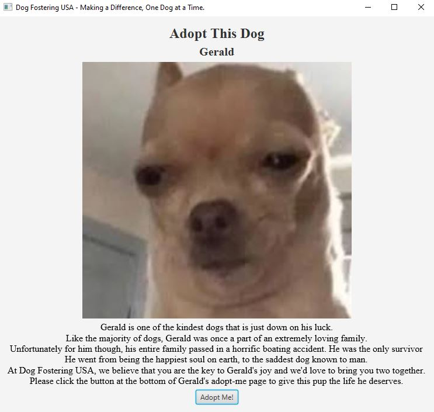

# GUI Informational Display

This assignment's purpose was to create an information GUI display using Java FX node types. There was not a specific 
item that needed to be constructed so we had the liberty to use our creativity. 

## Example Output



## Analysis Steps

Using the Java FX API Libraries, create a display that displays information. The display had to include, at the minimum, an image, a text heading,
a button, and a text box.


### Design

Since Java FX and GUI's are new to me, I decided to create a basic form that had, at the very least, nice spacing. 
I soon discovered that once I was able to understand one of the GUI building block, the others followed along quite closely. 

Since uploading an image seemed the most challenging, I started with that one, and I realized 
pretty quick that the rest are similar in syntax.

### Testing

```
Step One:
```

I had to familiarize myself with all of the components and, to be quite frank, how to even get the 
Java FX API Libraries added to my device. Thankfully, Professor Markley provided a couple of videos that made 
the set up straightforward. The REVEL content's videos were also extremely helpful in wrapping my mind around the ideas. 

```
Step Two:
```
Once I had an understanding of the building blocks, I had to come up with some sort of design to actually code. 
Personally, I did not think this kind of assignment required a wireframe sort of blueprint, especially considering that 
I most likely would not be able to implement a complicated design with my little knowledge at the moment. 

I went with a generic template that you'd normally see on an extremely basic website. 

```
Step Three:
```
At this point, it was all about coding everything and making sure that everything was as aesthetically pleasing
as I could make it... given my little experience with these new tools. Coming up with the text box text took me the longest. 

## Notes

Fortunate for me, I did not encounter any issues. I did notice at the end that I was reusing lots of the same code. Right now, 
I am not too worried about it since I am trying to learn this after all. For future projects, I will try to diversify the code I use.  

## Do not change content below this line
## Adapted from a README Built With

* [Dropwizard](http://www.dropwizard.io/1.0.2/docs/) - The web framework used
* [Maven](https://maven.apache.org/) - Dependency Management
* [ROME](https://rometools.github.io/rome/) - Used to generate RSS Feeds

## Contributing

Please read [CONTRIBUTING.md](https://gist.github.com/PurpleBooth/b24679402957c63ec426) for details on our code of conduct, and the process for submitting pull requests to us.

## Versioning

We use [SemVer](http://semver.org/) for versioning. For the versions available, see the [tags on this repository](https://github.com/your/project/tags). 

## Authors

* **Billie Thompson** - *Initial work* - [PurpleBooth](https://github.com/PurpleBooth)

See also the list of [contributors](https://github.com/your/project/contributors) who participated in this project.

## License

This project is licensed under the MIT License - see the [LICENSE.md](LICENSE.md) file for details

## Acknowledgments

* Hat tip to anyone who's code was used
* Inspiration
* etc
