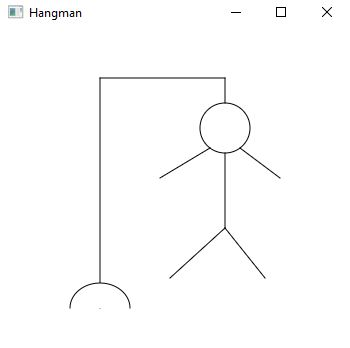

# Hangman Unit Project 1

For this project, we were tasked with creating a JavaFX program that displayed a hangman. 

## Example Output



## Analysis Steps

The only given was a picture of what our program should look like. Really, this image was
all that was necessary to create this project. The sample image could be broken down into several
sections to create the basic outline of what the program will consist of. 

### Design

First, I stared blankly at my screen hoping that the code would miraculously appear. This did not last
for very long because my programming duck gave me an unpleasant glare. Before I started typing any code,
I deconstructed the image into ten different pieces. Doing this allowed me to get started on the programming 
and testing of the project.

### Testing

Step one

```
After identifying ten different objects to create, I focused on preparing the stage and the pane. 
An artist needs a canvas!
```

Step two

```
After the initial width and height for the pane and stage had been created, I could begin drawing my figure. 
I decided to make the head of the hangman the center-of-attention so I started with that first. I made the 
circle object and sized, re-sized, and re-sided the re-size to exactly what fit best for my canvas.
```

Step three

```
I then had to position the circle to where I wanted the hangman to be. I had to play around with the positioning
a little before I found the spot where I wanted it to be. I also made sure to have even numbers so that the rest
of the objects would format/fit nicely together. 
```

Step four

```
I created the largest line and positioned it accordingly. From that line, I also created the only horizontal line
that the entire project has and made sure that one lined up well. I then connected all of those pieces 
to the top of the figure's head.
```

Step five

```
At this point, the platform was nearly done and I started on the body. I separated it into six different limbs.
They were the head, two arms, two legs, and the body. Using a little bit of math to ensure that the sizes were
the same and that they were just reflected about the y-axis (the body), I was able to correctly position them
and size them to be mirror images of each other (i.e left arm was the reflection of the right arm about the y-axis).
Taking a some extra time to do math made this section much quicker than "guess-timating". 
```

Step six

```
The entire hangman was built and ready, but the base was still missing. I concluded that this missing part was
simply an arc. I read the JavaFX documentation on the arc and implemented it for the base. I won't lie, I
struggled a little bit on this section because I overlooked the easiest thing. You see, I had nailed down the 
correct x and y coordinates to position it right at the center of the largest line, but I could not figure out
how to remove the line that was connecting the two ends of the arc. It turns out, the ArcType was set to CHORD
when it should have been set to OPEN so that it would be open-ended. Once I figured that out, the project was complete. 
```

## Notes

This was fun! Thank you, Prof. Markley.

## Do not change content below this line
## Adapted from a README Built With

* [Dropwizard](http://www.dropwizard.io/1.0.2/docs/) - The web framework used
* [Maven](https://maven.apache.org/) - Dependency Management
* [ROME](https://rometools.github.io/rome/) - Used to generate RSS Feeds

## Contributing

Please read [CONTRIBUTING.md](https://gist.github.com/PurpleBooth/b24679402957c63ec426) for details on our code of conduct, and the process for submitting pull requests to us.

## Versioning

We use [SemVer](http://semver.org/) for versioning. For the versions available, see the [tags on this repository](https://github.com/your/project/tags). 

## Authors

* **Billie Thompson** - *Initial work* - [PurpleBooth](https://github.com/PurpleBooth)

See also the list of [contributors](https://github.com/your/project/contributors) who participated in this project.

## License

This project is licensed under the MIT License - see the [LICENSE.md](LICENSE.md) file for details

## Acknowledgments

* Hat tip to anyone who's code was used
* Inspiration
* etc
