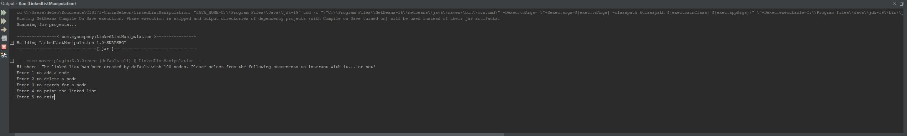

# Animation: Linked List

Write a program to animate search, insertion, and deletion in a linked list, as shown in in Figure 24.1b. The 
Search button searches the specified value in the list. The Delete button deleted the specified value from the list. 
The Insert button appends the value into the list if the index is not specified; otherwise, it inserts the value into the specified index in the list.

## Example Output



## Analysis Steps

The first thing that I did was analyze how the figure implemented what the assignment was asking for. Since I was already familiar with linked lists,
this part did not take me very long. I knew that I would have to develop a few methods to create what the assignment was asking for, but I also knew that
I would have to create additional methods to make the program useful. 

### Design

I approached my design by refreshing myself on linked lists and then breaking the assignment up into different sections. The major components of this project
were the search, insert, and delete method. Once those were created, I could focus on some finishing-touches. 

### Testing

Step one:

```
Create the linked list. For this section I needed to create the skeleton of the linked list. This involved creating a head for the linked list since all other
elements come after the head in a linked list and then I had to create some helper methods to actually create nodes and place them in the correct location along with their
own data and pointers.
```

Step two:

```
At this point, I needed to get started on the different methods. I spent a little bit of time researching how linked lists worked again and then I coded it. 
Since I had worked with linked lists previously, this step went by rather quickly. 
```

Step three:

```
Now that the three methods that the project called for were created, it was time to add some additional methods to make the program user-friendly. I created a print method that would
return the entire linked list. I also encapsulated my driver code within a do-while loop so that the user can freely play around with the linked list and test the efficacy of the code. 
```

## Notes

I started running out of time at the end so I was not able to implement the part of the assignment where a user would be able to indicate exactly where they wanted a specific node to be placed. 

## Do not change content below this line
## Adapted from a README Built With

* [Dropwizard](http://www.dropwizard.io/1.0.2/docs/) - The web framework used
* [Maven](https://maven.apache.org/) - Dependency Management
* [ROME](https://rometools.github.io/rome/) - Used to generate RSS Feeds

## Contributing

Please read [CONTRIBUTING.md](https://gist.github.com/PurpleBooth/b24679402957c63ec426) for details on our code of conduct, and the process for submitting pull requests to us.

## Versioning

We use [SemVer](http://semver.org/) for versioning. For the versions available, see the [tags on this repository](https://github.com/your/project/tags). 

## Authors

* **Billie Thompson** - *Initial work* - [PurpleBooth](https://github.com/PurpleBooth)

See also the list of [contributors](https://github.com/your/project/contributors) who participated in this project.

## License

This project is licensed under the MIT License - see the [LICENSE.md](LICENSE.md) file for details

## Acknowledgments

* Hat tip to anyone who's code was used
* Inspiration
* etc
