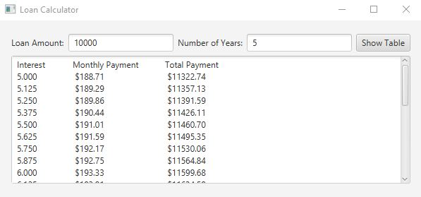

# Comparing Loans with Various Interest Rates

The purpose of this project was to use legacy code and convert it to a JavaFX program. As the project title states, in this program we had to compare loans with 
different interest rates. This is what the text of the assignment said...

Rewrite Programming Exercise 5.21 to create a GUI. Your program should let the user enter the loan
amount and load period in the number of years from text fields, and it should display the monthly and total
payments for each interest rate starting from 5% to 8%, with increments of one-eighth, in a text area.

## Example Output



## Analysis Steps

This assignment provided code to start out with. To be expected, the code looked like a foreign language to me at first glance so I knew I would have to spend some time studying it.
Lucky for me, I had already done a previous project with this program in the last semester so I did not have to spend much time studying the code. 

### Design

I knew that I would have to eventually turn the initial code into a method that would be compatible with an event listener. I assumed that to be the most difficult task (or was it? I guess we'll find out).

### Testing

Step one:

```
Convert the initial code into something that would work with an event listener. I decided to make everything that would entail the loan 
calculation into its own object. I chose to keep all the math within one method, but it could
definitely have been separated into 3 different methods. I needed the monthly interest rate,
the monthly payment, and the total payment. The initial code gave this to us so it was just a
matter of adapting it to work within the object. 
```

Step two: 

```
Once the calculation method had been tested and proved to be working properly, I moved on to 
build the skeleton of the project with JavaFX. I decided to go with a grid because I knew that
with a grid, I would be able to format everything neatly. I wanted to get as close as possible
to the image provided to us. 
```

Step three:
```
Now that the bones of the program was made and the brain of the program appeared to be working,
I gave my programming duck a high-five because I finished the project in record timing... except
I did not. After running the program, I realized that the numbers had two issues with them. 
First, my numbers did not have decimal places! They were whole numbers. Over time those pennies
add up. The second issue was that it was not at all formatted well. All of the numbers had 
different spacing and the table looked like a mess... definitely not like a table. 
```

Step four:
```
For the next couple of hours I spend time reviewing string formatting again. It had been 
a while since I had to implement it. Luckily, documentation exists and, thanks to these JavaFX
projects, I have been learning to quickly find what I need. That said, I still consumed quite
a bit of time playing around with the formatting to get all the numbers to line up properly. 
Once that was done, I realized that my numbers were whole numbers because I had converted them
to int rather than leaving them as double. Swapping out the variable type and then taking out
the conversion to int did the trick and all my money numbers had two decimal places.
```

## Notes

An other fun project!

## Do not change content below this line
## Adapted from a README Built With

* [Dropwizard](http://www.dropwizard.io/1.0.2/docs/) - The web framework used
* [Maven](https://maven.apache.org/) - Dependency Management
* [ROME](https://rometools.github.io/rome/) - Used to generate RSS Feeds

## Contributing

Please read [CONTRIBUTING.md](https://gist.github.com/PurpleBooth/b24679402957c63ec426) for details on our code of conduct, and the process for submitting pull requests to us.

## Versioning

We use [SemVer](http://semver.org/) for versioning. For the versions available, see the [tags on this repository](https://github.com/your/project/tags). 

## Authors

* **Billie Thompson** - *Initial work* - [PurpleBooth](https://github.com/PurpleBooth)

See also the list of [contributors](https://github.com/your/project/contributors) who participated in this project.

## License

This project is licensed under the MIT License - see the [LICENSE.md](LICENSE.md) file for details

## Acknowledgments

* Hat tip to anyone who's code was used
* Inspiration
* etc
