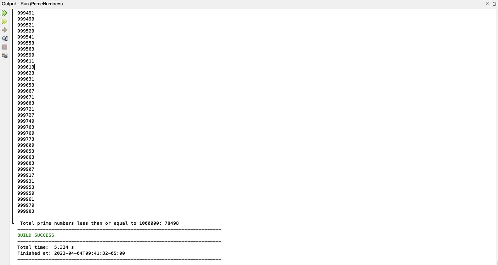

# All Prime Numbers Up to 1,000,000

Write a program that finds all prime numbers up to 1,000,000.

## Example Output



## Analysis Steps

For this project, we had to find prime numbers up to one million. There are several algorithms to find these numbers.
The issue is which one is going to be the quickest to do it. Since the project details were in a chapter about Developing
Efficient Algorithms, I knew that I would most likely have to read up on efficient prime number algorithms. 

### Design

The design would be quite simple. It consisted of three steps and testing could be done at the end once the program was fully developed. 
This is because the project was smaller in the sense of there were less things that I could mess up on. You can see my steps below.

### Testing

Step one: 

```
Define variables that were obvious. There were a couple of "givens" per se, that I knew would have to be implemented at some point or another.
Examples include the target number that we needed to hit (1,000,000), the number of prime numbers found, the array to store all the numbers
as Boolean, etc.
```

Step two:

```
At this point I had to implement the algorithm, but I had one severe issue. I did not understand it quite well. Not a 
problem though! The book was able to give me a good base to start with and YouTube clarified it a lot well. I attempted 
to explain it in the code comments. 
```

Step three:
```
Now it was just a matter of printing the results and testing for any mistake. Thankfully, I did not encounter any 
issues which was extremely surprising to me considering I was a stranger to this concept before I started the project. 
```

## Notes

I thought it was fascinating how quickly the computer was able to execute this program. Also, it is always so satisfying
seeing it work for the first time. 


## Do not change content below this line
## Adapted from a README Built With

* [Dropwizard](http://www.dropwizard.io/1.0.2/docs/) - The web framework used
* [Maven](https://maven.apache.org/) - Dependency Management
* [ROME](https://rometools.github.io/rome/) - Used to generate RSS Feeds

## Contributing

Please read [CONTRIBUTING.md](https://gist.github.com/PurpleBooth/b24679402957c63ec426) for details on our code of conduct, and the process for submitting pull requests to us.

## Versioning

We use [SemVer](http://semver.org/) for versioning. For the versions available, see the [tags on this repository](https://github.com/your/project/tags). 

## Authors

* **Billie Thompson** - *Initial work* - [PurpleBooth](https://github.com/PurpleBooth)

See also the list of [contributors](https://github.com/your/project/contributors) who participated in this project.

## License

This project is licensed under the MIT License - see the [LICENSE.md](LICENSE.md) file for details

## Acknowledgments

* Hat tip to anyone who's code was used
* Inspiration
* etc
