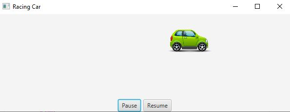

# Racing Car

The purpose of this project was to experiment more with JavaFX and, more specifically, event listeners. For this project, 
I had to create a program that would display a "race car" and add two buttons to the pane that would allow a user to pause and resume
the car's movement. I also needed to implement a keystroke event listener that would allow the user to increase the speed or decrease it.
We were allowed to use image files for this assignment so I went with it. However, implementing this project without an image file
would not be more or less difficult since the basic idea is the same; move an object from one x-coordinate to the next one and so forth.

## Example Output



## Analysis Steps

The project outline did not give much direction besides stating that the car should move from left to right and when it reaches the
end, it should restart. It also required two buttons that allow the user to pause and resume the car's movement. The last requirement
was the allow the user to increase and decrease the speed with a keystroke. With this information, I broke the assignment up into
manageable pieces. 

### Design

First, I would create the object and its movement. Next, I would create the buttons and their event listeners and,
last, I would create the event listeners for the speed control. 


### Testing

Things do not always go as planned so there was a lot more testing and debugging than there was code writing. There was also, yet again,
much time staring at the screen blankly. This time, I did not have a programming duck with me which is why I took longer finishing
this project. Here are my steps:


Step One

```
I created the horizontal box that container the two buttons and put it at the bottom of the pane. I did not add event listeners to the
buttons at this point because I wanted to make sure that the program was exactly what I was envisioning. I also added the car via image
and image view. Later on, I realized that things would go much smoother if I made the car an actual object instead of just adding
the image and image view in the start method. Making it its own object would allow me to control other variables. 
```

Step Two

```
Step one kind of bleeds in to step two. I realized that the image I had selected was far too large for my view port and that would be a
problem when I attempted to move the car from left to right. I could have just surfed the web and found a smaller image, but that would not
help me in the future if I was obligated to use the provided picture. Thankfully, the JavaFX documentation had an example where the image
was resized, but, at the same time, maintained the aspect ratio. This was perfect for this application so, you can see in line 115 and
116 the implementation of those methods. 
```

Step Three

```
At this point, I created a Timeline within the start method, but I could not control it with any other methods because it was not global. 
After staring at my screen for hours, I had a very-much-needed realization. It was that I could create the Timeline within the CarPane
class so that I could access it via class methods. So I initialized it and added methods to control the timeline pause and timeline play.
This would, in effect, allow the user to make the car stop and start. Another way I could have done this was to just make the speed 0 
and then increase the speed to the last speed. This would also give a pause/resume effect, but I thought of the former fist. 
```

Step four

```
Concurrent with step three, I also created a method to move the car across the x-axis. I determined that best solution for this
was the simplest solution, so the method would essentially move the car by taking the current position and adding the speed it is
traveling at and making the sum of those two the new position. To make the car restart from the left, I just had to add statement
that would read when the car passed a certain threshold and, once it had, it would set the position back to 0. I could have done this
with a if-then-else statement, but there is no fun in that and I wanted to practice the ternary operator. You can see this implement in
line 125. 
```

Step five

```
The last thing I needed to do was add event listeners to the buttons and an event listener for specific keystrokes. The button
event listeners were pretty easy to do. I had already created all the methods that I would need to create the desired effect so I only
had to see how I could make those events fire when a specified event happen. Then, I mapped those events to the corresponding buttons. 
Foolishly, I thought that the keystroke event listener would be just as simple, but I struggled with this part for hours. 
```

Step six 

```
When I first implemented the key event, I thought that something was wrong with my method. The idea behind the method was to just 
reduce the speed by a specific number when the key was pressed. Likewise, increase the speed when a different key was pressed. When 
I tested it, nothing happened so I thought that the variable was the issue. After trying that for hours, I conclude that it was not the
method that was the issue but the actual key event itself. I was able to determine this when I made a general event at keystroke (aka, 
System.out.println("The button was clicked!");
```

Step seven 

```
After my genius debugging, I realized that the program was not recognizing my arrow up and arrow down key. I could not find a solution for
it unfortunately, so, as an alternative, I used the f key for faster and the s key for slower. This was all that I needed to do for the
methods to fire off and create the desired outcome. After this step, the last few things were just minor touch-ups to make the program
cleaner.  
```

## Notes

I exhausted all my resources trying to determine why my program would not register the up arrow and the down arrow. I am still unsure
of why it does not register it, but I added alternatives so that the program would still function. 

Experimenting with JavaFX has been such a great experience so far. I mean, every once in a while there are some things that are a pain
to do, but that is to be expected. This was another fun project. 

## Do not change content below this line
## Adapted from a README Built With

* [Dropwizard](http://www.dropwizard.io/1.0.2/docs/) - The web framework used
* [Maven](https://maven.apache.org/) - Dependency Management
* [ROME](https://rometools.github.io/rome/) - Used to generate RSS Feeds

## Contributing

Please read [CONTRIBUTING.md](https://gist.github.com/PurpleBooth/b24679402957c63ec426) for details on our code of conduct, and the process for submitting pull requests to us.

## Versioning

We use [SemVer](http://semver.org/) for versioning. For the versions available, see the [tags on this repository](https://github.com/your/project/tags). 

## Authors

* **Billie Thompson** - *Initial work* - [PurpleBooth](https://github.com/PurpleBooth)

See also the list of [contributors](https://github.com/your/project/contributors) who participated in this project.

## License

This project is licensed under the MIT License - see the [LICENSE.md](LICENSE.md) file for details

## Acknowledgments

* Hat tip to anyone who's code was used
* Inspiration
* etc
