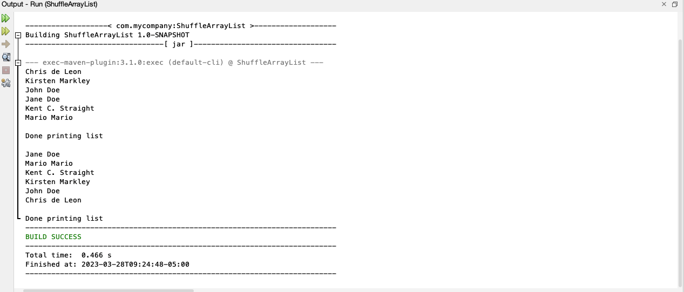

# Shuffle ArrayList

Design a class named Person. A person has a name, address, phone number, and email address. The class should
contain a static Load method that loads test data (person instances) into an ArrayList. Use this ArrayList of
Person objects to complete exercise 19.8.

Complete Exercise 19.8 in your book. You must implement generics.

## Example Output



## Analysis Steps

I broke this assignment up into a few different pieces. The three pieces would be creating the ArrayList and 
the Person object along with its necessary constructors. After that I needed to create the method that would
allow me to insert new Persons into the ArrayList. Lastly, I had to create a method that would allow me to shuffle
the entire ArrayList.

### Design

Thanks to the analysis steps, the design became quite simple. Though, we'll later see in the testing that there
were a few hiccups. I decided to begin with what I was most familiar, which was the ArrayList and the Person
object. The load method also came easy. The shuffle method required a bit of thinking, but was eventually easy to 
implement once I understood the concept... funny how that works, huh.

### Testing 

Step one:

```
Create the ArrayList. This step was really easy. All I had to do was import the correct java.util library and then 
create an instance of the ArrayList in my main method.
```

Step two:

```
With the ArrayList created, I now needed to create a class named Person as the assignment required. This was also easy.
I developed the Person object, added different variables of String type to store the individual's information, 
and created a constructor method to create a new person and automatically add them to the ArrayList.
```

Step three:

```
At this point, I needed to print the ArrayList and ensure everything was working. Once confirmed, the final thing
I needed to do was implement the shuffle method provided by the book. Now they did not provide the logic to perform
the shuffle, they only provided the name of the method and its syntax.
```

Step four:

```
I had to figure out an algorithm to shuffle the ArrayList. Honestly, it had been a while since I had to do a shuffle
type of method so this part took me quite a bit of time, but I was finally able to determine a few key points: 1) I
would be dealing with a random number at some point so creating a random number and importing the java.util library
would be necessary. 2) I knew that in any method where something is taking the spot of something else, we need to 
ensure that we don't lose the new empty spot so a holder variable is necessary.
```

Step five:
```
Now that I had the essentials, I took a bit of time and played around with the code until I got the result I was
anticipating. I had to test the code once more to ensure it was printing fine and that all the information was still
there, just in a different order.
```

## Notes

No notes this time!

## Do not change content below this line
## Adapted from a README Built With

* [Dropwizard](http://www.dropwizard.io/1.0.2/docs/) - The web framework used
* [Maven](https://maven.apache.org/) - Dependency Management
* [ROME](https://rometools.github.io/rome/) - Used to generate RSS Feeds

## Contributing

Please read [CONTRIBUTING.md](https://gist.github.com/PurpleBooth/b24679402957c63ec426) for details on our code of conduct, and the process for submitting pull requests to us.

## Versioning

We use [SemVer](http://semver.org/) for versioning. For the versions available, see the [tags on this repository](https://github.com/your/project/tags). 

## Authors

* **Billie Thompson** - *Initial work* - [PurpleBooth](https://github.com/PurpleBooth)

See also the list of [contributors](https://github.com/your/project/contributors) who participated in this project.

## License

This project is licensed under the MIT License - see the [LICENSE.md](LICENSE.md) file for details

## Acknowledgments

* Hat tip to anyone who's code was used
* Inspiration
* etc
