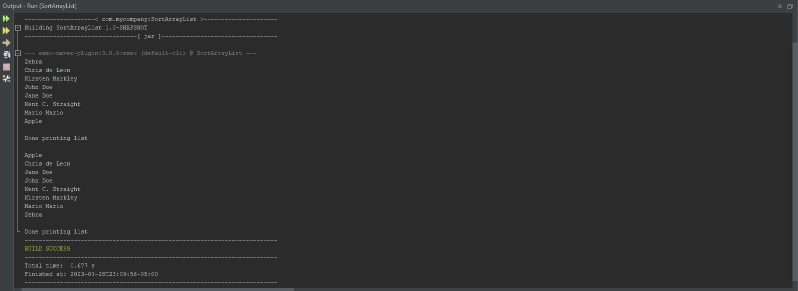

# Exercise 19.9 Sort ArrayList

Design a class named Person. A person has a name, address, phone number and email address. 
The class should contain a static Load method that loads test data (person instances) 
into an ArrayList. Use this ArrayList of Person objects to complete exercise 19.9.

## Example Output



## Analysis Steps

For this assignment we had to build another function to a previous project using code provided
by the textbook. The other methods should have been functioning already so I will not be providing
analysis on the repeated items.

### Design

The design for this project required reading lots of documentation and refining my understanding
on Java interfaces and implementations. In retrospect, I am glad this assignment challenged me
to lean into ideas that were a bit new to me because I otherwise may have not understood it clearly. 

### Testing 

Step one:

```
At first, I thought that the assignment wanted me to create some sort of algorithm to sort the ArrayList. 
Not only did that prove to be difficult, it also nearly caused me to lose my mind! Luckily, I took a bit of time 
away from the screen and, while I was doing something completely unrelated, it hit me.
```

Step two:

```
Once I copied the code to my original code, I came to the conclusion that something had to go inside that method. After thoroughly
reading through the extra reading that Prof. Markely provided, I discovered the few items I was missing in my code. I needed to call
the Collections.sort() method on the ArrayList within the sort method and I also needed to ensure that the Person object was implementing
Comparable<Person>. This would indicate to the program that I wanted to compare the Person objects to something else. 
```

Step three:
```
Now with the two missing pieces, my code would work, right? Wrong! I quickly found out that I was also missing a compareTo method to compare
the Person objects. After all, the code only knew that I wanted to compare the Person object to something... note: something... You see, computers
don't really do well when you don't clarify what exactly you're wanting to compare. That's what the compareTo method was for. I had to override it and 
then tell the computer that I wanted to compare Person name to other Person name. Now, at long last, the code was functioning properly and the code was 
alphabetized.
```

## Notes

Since you made it this far on my journey, here's a little humor for you. Please note, it was starting to get late when I was just about finished with this project.
I unintendedly made my ArrayList already appear in near-alphabetical order. There were quite literally only two names that were not in order. Obviously, with a tired mind
and empty stomach, this threw me off. I stared at my screen trying to debug what was going on with my code for a few hours... only to finally realize that I naturally created this ArrayList
in alphabetical order... that's the reason you see Apple and Zebra in the code. I needed absolute certainity that my code was working properly. Anyways, that's it. Thanks, Prof. Markley.

## Do not change content below this line
## Adapted from a README Built With

* [Dropwizard](http://www.dropwizard.io/1.0.2/docs/) - The web framework used
* [Maven](https://maven.apache.org/) - Dependency Management
* [ROME](https://rometools.github.io/rome/) - Used to generate RSS Feeds

## Contributing

Please read [CONTRIBUTING.md](https://gist.github.com/PurpleBooth/b24679402957c63ec426) for details on our code of conduct, and the process for submitting pull requests to us.

## Versioning

We use [SemVer](http://semver.org/) for versioning. For the versions available, see the [tags on this repository](https://github.com/your/project/tags). 

## Authors

* **Billie Thompson** - *Initial work* - [PurpleBooth](https://github.com/PurpleBooth)

See also the list of [contributors](https://github.com/your/project/contributors) who participated in this project.

## License

This project is licensed under the MIT License - see the [LICENSE.md](LICENSE.md) file for details

## Acknowledgments

* Hat tip to anyone who's code was used
* Inspiration
* etc
