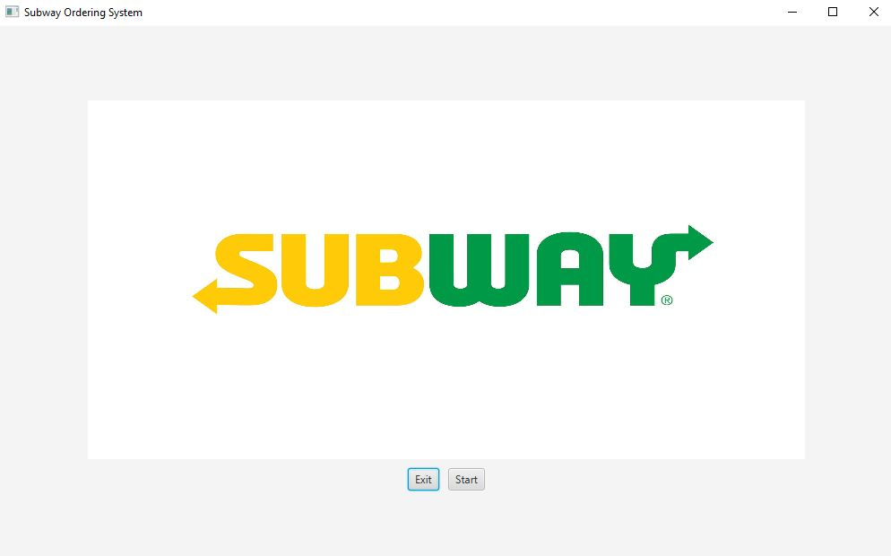

# Subway Order System

Build an automated ordering system for Subway. It will use a GUI to interact with the user. The user should have the ability to choose size of sandwich, type of bread, type of meat, type of cheese, up to three veggies choices, type of sauce, and yes or no to salt and pepper. A summary display should show all of the options chosen by the user.  

## Example Output

(FirstView.jpg)(SecondView.jpg)(ThirdView.jpg)(SummaryView.jpg)

## Analysis Steps

For this assignment, I took inspiration from different food builder applications that large companies have. With that in mind, I decided to split up this assignment into different section that somewhat correspond to the way you would normally order a sub at Subway. 

### Design

Since we were only dealing with the sub as an object, it was the only class I created. Everything else was in the start method.
I first developed the GUI and then I added all the connectors to ensure the proper data was stored in the object. 

### Testing

Step one:

```
The first step was recalling how I would order a sub at Subway. I wanted the experience for the user to be a near reflection of what a customer would experience in the brick and mortar store. At the same time, I wanted this to be a pretty straightforward application. With those two things in mind, I decided to divide the program into a few different section, first the welcome screen, then the sandwich size and type, then the cheese and protein, then the veggies and condiments. The last view would be the summary view. 
```

Step two: 

```
Now that I had a rough idea of what I was going to create, I started creating the first scene. This was the easiest one since it only has three components: the logo, a exit button, and a continue button. I followed the same kind of functionality to give the user a simple experience. 
```

Step three: 

```
The next view was the size selection and the bread type selection. I used a combination of radio buttons and toggle groups to accomplish this. Once those were created, I added another button to go to the next page. 
```

Step four:

```
At this point, the user was given the option to choose cheese and protein. This section was similar to the last section, in fact, because I focused on making my code resuable, I was able to quite literally copy and paste the same code from the previous page, but adjust the wording on different items as necessary. 
```

Step five: 

```
In the following section, I wasn't able to reuse the code and quite frankly, I didn't want to. I wanted to try different things out so I decided to make the veggie and condiment section checkboxes instead of radio buttons. Creating the GUI component of it was quite easy, but further down the road, adding code to connect the backened to the frontend was a bit of a hassle. 
```

Step six: 

```
The summary page was the second easiest to create. All I had to do was repopulate the user's selection onto the screen. 
```

Step seven: 

```
Now that the GUI aspect of the project was complete, I had to create the backend of it. This list is quite extensive, but I will provide a short summary of everything that I did. First, I had to create the sandwich object to store all the information. Then I had to instantiate that object in the main method. Once that was done, I had to set up event listeners and add .setOnAction methods to buttons so that the information that the user selected would be stored. This was achievable via simple getters and setters called from the sandwich object. The most complex portion of this was figuring out how to get the checkboxes to disable after 3 checkboxes had been selected. I was able to do it using simple if-else statements and a counter stored in the sandwich object that would be changed via method calls within each checkbox. Stating it is much simpler than implementing.
```

## Notes

Instructions for using the program: click the start button and begin, the choose your bread size and the type of bread and hit the button to go to the next screen. From there, choose which cheese you want as well as the protein that you want. Then, select the veggies that you want as well as the condiments. Lastly choose if you want salt and pepper. The last button will take you to a screen where you can view your summary. Enjoy! 

## Do not change content below this line
## Adapted from a README Built With

* [Dropwizard](http://www.dropwizard.io/1.0.2/docs/) - The web framework used
* [Maven](https://maven.apache.org/) - Dependency Management
* [ROME](https://rometools.github.io/rome/) - Used to generate RSS Feeds

## Contributing

Please read [CONTRIBUTING.md](https://gist.github.com/PurpleBooth/b24679402957c63ec426) for details on our code of conduct, and the process for submitting pull requests to us.

## Versioning

We use [SemVer](http://semver.org/) for versioning. For the versions available, see the [tags on this repository](https://github.com/your/project/tags). 

## Authors

* **Billie Thompson** - *Initial work* - [PurpleBooth](https://github.com/PurpleBooth)

See also the list of [contributors](https://github.com/your/project/contributors) who participated in this project.

## License

This project is licensed under the MIT License - see the [LICENSE.md](LICENSE.md) file for details

## Acknowledgments

* Hat tip to anyone who's code was used
* Inspiration
* etc
